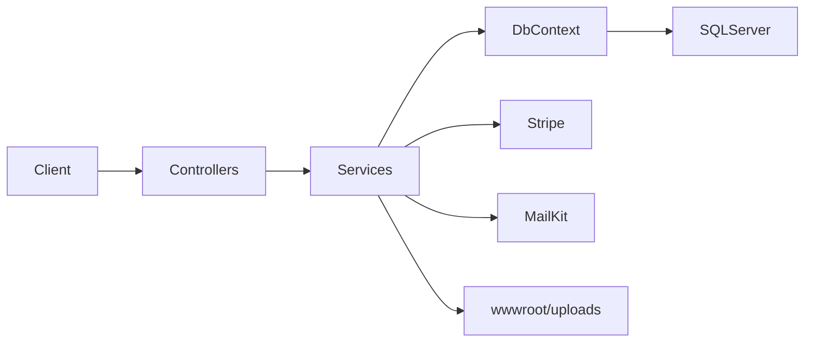

# Stylek Fashion API — Implementation Plan

## Current state

Workspace [`A:\api`](A:\api) is **empty**. This is a **greenfield** build: one project, one `.csproj`, all code under `StylekAPI/`.

## Architecture (single project)



| Layer | Responsibility |
|--------|----------------|
| [Controllers/](StylekAPI/Controllers/) | HTTP, `[Authorize]`, bind DTOs, return `ApiResponse<T>` |
| [Services/](StylekAPI/Services/) | Business logic; inject `ApplicationDbContext` directly |
| [Data/](StylekAPI/Data/) | `ApplicationDbContext`, migrations, `DatabaseSeeder` |
| [Validators/](StylekAPI/Validators/) | FluentValidation for every request DTO |
| [Mapping/](StylekAPI/Mapping/) | AutoMapper profiles |
| [Helpers/](StylekAPI/Helpers/) | JWT, files, pagination, enums |
| [Middleware/](StylekAPI/Middleware/) | Global exceptions + auth rate limit |

**Confirmed choices:** local image storage under `wwwroot/uploads`; add a **`Banner`** entity for homepage slides.

---

## 1. Project bootstrap

```bash
dotnet new webapi -n StylekAPI -f net10.0
cd StylekAPI
dotnet add package Microsoft.EntityFrameworkCore.SqlServer
dotnet add package Microsoft.EntityFrameworkCore.Tools
dotnet add package Microsoft.AspNetCore.Identity.EntityFrameworkCore
dotnet add package Microsoft.AspNetCore.Authentication.JwtBearer
dotnet add package AutoMapper.Extensions.Microsoft.DependencyInjection
dotnet add package FluentValidation.AspNetCore
dotnet add package Stripe.net
dotnet add package MailKit
dotnet add package Swashbuckle.AspNetCore
```

- Target **.NET 10** (`net10.0`); if SDK is missing, install .NET 10 SDK first.
- Enable nullable reference types and implicit usings (template defaults).
- Create folder layout exactly as specified (no extra projects).

---

## 2. Models — entities and enums

### Enums ([`Models/Enums/`](StylekAPI/Models/Enums/))

- `Gender`: Man, Woman, Baby  
- `OrderStatus`: Pending, Confirmed, Processing, Shipped, Delivered, Cancelled  
- `PaymentMethod`: CashOnDelivery, Stripe  
- `PaymentStatus`: Pending, Paid, Failed, Refunded  
- `OtpPurpose`: ForgotPassword (extensible)

### Entities ([`Models/`](StylekAPI/Models/))

| Entity | Key fields / notes |
|--------|-------------------|
| `ApplicationUser` | Extends `IdentityUser`: `FullName`, `AvatarUrl`, `PreferredLanguage` (ar/en), `IsActive`, `RefreshToken`, `RefreshTokenExpiry`, `CreatedAt` |
| `Category` | `NameEn`, `NameAr`, `Slug`, `Gender`, `ImageUrl`, `DisplayOrder`, `IsActive` |
| `Product` | FK `CategoryId`, bilingual names/descriptions, `Price`, `DiscountPrice`, `Gender`, `IsFeatured`, `IsLuxury`, `IsNewArrival`, `IsBestSeller`, `Stock`, `IsActive`, timestamps |
| `ProductImage` | FK `ProductId`, `ImageUrl`, `IsPrimary`, `DisplayOrder` |
| `ProductVariant` | FK `ProductId`, `Size`, `Color`, `Stock`, `Sku` |
| `CartItem` | FK `UserId`, `ProductId`, optional `ProductVariantId`, `Quantity`; unique per user+product+variant |
| `WishlistItem` | FK `UserId`, `ProductId`; unique per user+product |
| `Order` | `OrderNumber`, `UserId`, status enums, `SubTotal`, `DiscountAmount`, `ShippingFee`, `TotalAmount`, shipping fields, optional `CouponId`, `StripePaymentIntentId`, `IsActive` (soft cancel) |
| `OrderItem` | Snapshot: `ProductName`, `Size`, `Color`, `Quantity`, `UnitPrice` |
| `Coupon` | `Code`, `DiscountPercent` or `DiscountAmount`, `MinOrderAmount`, `ExpiryDate`, `MaxUses`, `UsedCount`, `IsActive` |
| `Review` | FK `UserId`, `ProductId`, `Rating` (1–5), `Comment`, `LikesCount`, `IsActive` |
| `ReviewLike` | FK `UserId`, `ReviewId` (for “like review” without duplicate likes) |
| `OtpCode` | `Email`, `Code`, `Purpose`, `ExpiresAt`, `IsUsed` |
| `Banner` | `TitleEn/Ar`, `ImageUrl`, `LinkUrl`, `DisplayOrder`, `IsActive` |

Navigation properties and `IsActive` on all user-facing catalog rows for **soft delete**.

---

## 3. Data layer

### [`Data/ApplicationDbContext.cs`](StylekAPI/Data/ApplicationDbContext.cs)

- Inherit `IdentityDbContext<ApplicationUser>`
- `DbSet<>` for all entities above
- Fluent API in `OnModelCreating`:
  - Decimal precision `Price` fields (18,2)
  - Unique indexes: `Coupon.Code`, cart/wishlist composites, `Order.OrderNumber`
  - Cascade rules: delete images/variants with product; restrict order items
  - Global query filter optional: `IsActive == true` only where it would not break admin/order history (apply on Product/Category/Banner, not Orders)

### [`Data/DatabaseSeeder.cs`](StylekAPI/Data/DatabaseSeeder.cs)

Run from `Program.cs` after `Migrate()`:

1. **Roles:** `Admin`, `Customer`  
2. **Admin user:** `admin@stylek.com` / strong password from config  
3. **Categories (3):** Man, Woman, Baby (bilingual names, slugs, gender)  
4. **Products (10):** spread across categories; mix featured/luxury/new/best-seller flags; 1–2 images each; a few variants  
5. **Banners (2–3):** placeholder images under uploads or seeded URLs  
6. **Sample coupon:** e.g. `STYLEK10` (10% off, min order)

---

## 4. Configuration — [`appsettings.json`](StylekAPI/appsettings.json)

```json
{
  "ConnectionStrings": { "DefaultConnection": "Server=...;Database=StylekDB;..." },
  "Jwt": { "Key": "...", "Issuer": "StylekAPI", "Audience": "StylekApp", "AccessTokenMinutes": 60, "RefreshTokenDays": 7 },
  "Stripe": { "SecretKey": "sk_test_...", "WebhookSecret": "whsec_...", "Currency": "egp" },
  "Email": { "Host": "smtp...", "Port": 587, "User": "...", "Password": "...", "From": "noreply@stylek.com", "FromName": "Stylek" },
  "App": { "BaseUrl": "https://localhost:5001", "UploadPath": "wwwroot/uploads" }
}
```

`appsettings.Development.json` overrides for local SQL Server / LocalDB.

---

## 5. Helpers and API contract

### [`Helpers/ApiResponse.cs`](StylekAPI/Helpers/ApiResponse.cs)

```csharp
public class ApiResponse<T> {
  public bool Success { get; set; }
  public string Message { get; set; }
  public T? Data { get; set; }
  public List<string>? Errors { get; set; }
}
```

Static factories: `Ok(data, message)`, `Fail(message, errors)`.

### Other helpers

- **`JwtTokenHelper`:** access + refresh token generation; read claims (`userId`, `email`)  
- **`PaginationHelper`:** `PagedResult<T>` with `Items`, `Page`, `PageSize`, `TotalCount`, `TotalPages`  
- **`FileUploadHelper`:** validate `.jpg/.png/.webp`, max 5MB; save to `wwwroot/uploads/{avatars|products|banners}`; return relative URL  
- **`OrderNumberGenerator`:** e.g. `SK-{yyyyMMdd}-{random}`  

Controllers always return `ActionResult<ApiResponse<T>>` with consistent HTTP codes (400 validation, 401 unauthorized, 404 not found, 200 success).

---

## 6. DTOs (by area)

Organize under [`DTOs/Auth/`](StylekAPI/DTOs/Auth/), `Products/`, `Cart/`, etc.

**Auth:** `RegisterDto`, `LoginDto`, `RefreshTokenDto`, `ForgotPasswordDto`, `VerifyOtpDto`, `ResetPasswordDto`  
**Profile:** `UpdateProfileDto`, `ChangePasswordDto`  
**Products:** `ProductFilterDto` (categoryId, gender, minPrice, maxPrice, search, sort, page, pageSize), `ProductListDto`, `ProductDetailDto`  
**Cart:** `AddCartItemDto`, `UpdateCartQuantityDto`, `ApplyCouponDto`, `CartDto`  
**Orders:** `CreateOrderDto` (address fields, payment method), `OrderDto`, `OrderDetailDto`, `TrackOrderDto`  
**Reviews:** `CreateReviewDto`, `UpdateReviewDto`, `ReviewDto`  
**Payments:** `CreatePaymentIntentDto`, `PaymentIntentResponseDto`  
**Home:** `HomePageDto` (banners, categories, product lists)

All list endpoints use pagination defaults: `page=1`, `pageSize=12`.

---

## 7. FluentValidation — [`Validators/`](StylekAPI/Validators/)

One validator per request DTO, registered in `Program.cs`:

```csharp
builder.Services.AddValidatorsFromAssemblyContaining<RegisterDtoValidator>();
builder.Services.AddFluentValidationAutoValidation();
```

Examples:

- Register: email, password strength, full name  
- Login: required email/password  
- Product filters: price min ≤ max, pageSize ≤ 50  
- Review: rating 1–5, comment max length  
- Create order: required shipping fields, valid payment method  

Validation errors map to `ApiResponse` with `errors` list (integrate via exception middleware or filter).

---

## 8. AutoMapper — [`Mapping/MappingProfile.cs`](StylekAPI/Mapping/MappingProfile.cs)

Maps:

- `Product` → `ProductListDto` / `ProductDetailDto` (include images, variants, avg rating)  
- `Category` → `CategoryDto`  
- `ApplicationUser` → `ProfileDto`  
- `Order` + `OrderItems` → `OrderDetailDto`  
- `Review` → `ReviewDto` (include user display name, `IsLikedByCurrentUser`)  
- `CartItem` → line DTOs with computed line total (EGP)

---

## 9. Services (direct DbContext)

| Service | Main responsibilities |
|---------|----------------------|
| `AuthService` | Register/login/logout/refresh; store refresh token + expiry on user; OTP forgot-password flow |
| `OtpService` | Generate 6-digit code, save `OtpCode`, 10-min expiry, mark used |
| `EmailService` | MailKit SMTP: OTP email, order confirmation (optional on create) |
| `ProfileService` | Get/update profile, change password, avatar upload, deactivate (`IsActive=false`) |
| `CategoryService` | List active categories; get by id |
| `ProductService` | Filtered/paged list, search (`EF.Functions.Like`), featured, by id with includes |
| `CartService` | CRUD cart lines; recalc totals; apply coupon validation |
| `WishlistService` | Add/remove/check |
| `OrderService` | Create from cart (transaction): decrement stock, apply coupon, clear cart; list/detail; cancel if Pending; track status timeline |
| `PaymentService` | Stripe PaymentIntent (amount in piastres: EGP × 100); webhook verifies signature, updates `PaymentStatus` / `OrderStatus` |
| `ReviewService` | CRUD (owner only edit/delete); like toggle via `ReviewLike` |
| `HomeService` | Aggregate banners, categories, new arrivals, best sellers, luxury, offers (discounted products) |

**Auth flow details:**

- Login returns `{ accessToken, refreshToken, expiresAt, user }`  
- Refresh: validate stored token + expiry → rotate refresh token  
- Forgot password: create OTP → email → verify → reset with `UserManager.ResetPasswordAsync`  
- Logout: clear refresh token on user  

**Rate limiting:** [`Middleware/AuthRateLimitMiddleware.cs`](StylekAPI/Middleware/AuthRateLimitMiddleware.cs) — in-memory `ConcurrentDictionary` keyed by IP; limit e.g. 10 requests / minute on `/api/auth/login`, `register`, `forgot-password` (simple, no Redis).

---

## 10. Controllers and routes

Base route: `api/[controller]`. All use `[ApiController]`.

| Controller | Endpoints | Auth |
|------------|-----------|------|
| `AuthController` | POST register, login, refresh, forgot-password, verify-otp, reset-password, logout; GET me | me/logout: JWT |
| `ProfileController` | GET/PUT profile, POST change-password, POST avatar, POST deactivate | JWT |
| `CategoriesController` | GET all, GET `{id}` | Public |
| `ProductsController` | GET (filters), GET `{id}`, GET search, GET featured | Public |
| `CartController` | POST add, PUT quantity, DELETE item, DELETE clear, POST apply-coupon | JWT |
| `WishlistController` | POST add, DELETE remove, GET check `{productId}` | JWT |
| `OrdersController` | POST create, GET mine, GET `{id}`, POST `{id}/cancel`, GET `{id}/track` | JWT |
| `PaymentsController` | POST create-intent, POST webhook | Intent: JWT; webhook: anonymous + Stripe signature |
| `ReviewsController` | POST, PUT, DELETE, POST `{id}/like`, GET by product | Like/write: JWT; GET public |
| `HomeController` | GET homepage | Public |

**Stripe webhook:** read raw body, `EventUtility.ConstructEvent`, handle `payment_intent.succeeded` / `payment_intent.payment_failed` → update order.

**Image upload endpoints:** `ProfileController` avatar; product images can be seeded only in v1 (admin upload out of scope unless you want a single admin endpoint later).

---

## 11. Middleware and cross-cutting

### [`Middleware/ExceptionMiddleware.cs`](StylekAPI/Middleware/ExceptionMiddleware.cs)

Catch `ValidationException`, `UnauthorizedAccessException`, `KeyNotFoundException`, generic → JSON `ApiResponse` with appropriate status.

### `Program.cs` pipeline order

1. Exception middleware  
2. HTTPS redirection  
3. Static files (`wwwroot`)  
4. Auth rate limit middleware  
5. Authentication / Authorization  
6. Swagger + SwaggerUI (JWT bearer scheme)  
7. Map controllers  

### Identity + JWT setup

- `AddIdentity<ApplicationUser, IdentityRole>()` + EF stores  
- `AddAuthentication().AddJwtBearer()` with validation parameters from config  
- Password options: Identity defaults (hashing built-in)  
- `AddAuthorization()`; `[Authorize(Roles = "Admin")]` only if needed later  

### Swagger

- Document v1, title "Stylek API"  
- `AddSecurityDefinition` Bearer + global requirement  

---

## 12. Key business rules

| Rule | Implementation |
|------|----------------|
| Currency EGP | Display/format in DTOs; Stripe `Currency = "egp"` |
| Soft delete | `IsActive = false`; queries filter active catalog |
| OTP 10 min | `ExpiresAt = UtcNow.AddMinutes(10)` |
| Cart → Order | `IDbContextTransaction`; validate stock; snapshot prices on `OrderItem` |
| Cancel order | Only if `OrderStatus == Pending` |
| Coupon | Check expiry, max uses, min order; increment `UsedCount` on successful order |
| Reviews | One review per user per product; like idempotent toggle |
| File upload | jpg/png/webp, ≤ 5MB via `FileUploadHelper` |

---

## 13. Implementation order (generation sequence)

1. Enums + Models + `ApplicationDbContext`  
2. Initial migration + `DatabaseSeeder`  
3. Helpers (`ApiResponse`, JWT, files, pagination)  
4. DTOs (all areas)  
5. Validators (all request DTOs)  
6. `MappingProfile`  
7. Services (Auth → Profile → Catalog → Cart/Wishlist → Orders → Payments → Reviews → Home)  
8. Middleware  
9. Controllers  
10. `Program.cs` + `appsettings.json`  
11. Run `dotnet ef database update` and smoke-test via Swagger  

---

## 14. Verification checklist

- [ ] Register → Login → `GET /api/auth/me` with Bearer token  
- [ ] Refresh token rotation works; logout invalidates refresh  
- [ ] Forgot password OTP email (or log OTP in dev if SMTP not configured)  
- [ ] Products filter by gender, category, price, search, sort  
- [ ] Cart + coupon + create order reduces stock  
- [ ] Stripe test intent + webhook updates payment status  
- [ ] Homepage returns all sections  
- [ ] Upload avatar rejects >5MB / wrong extension  
- [ ] Auth endpoints return 429 after rate limit threshold  

---

## File count estimate

~70–90 C# files in one project—large but linear and junior-readable. No repositories, no extra assemblies.

## Risk notes

- **SMTP/Stripe keys** must be real in `appsettings` for full E2E; document dev fallback (log OTP to console).  
- **SQL Server** must be running before migration.  
- Ensure **.NET 10 SDK** is installed; if unavailable, temporarily target `net9.0` only as a fallback after confirming with you.
